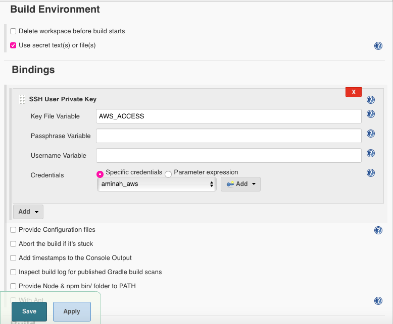
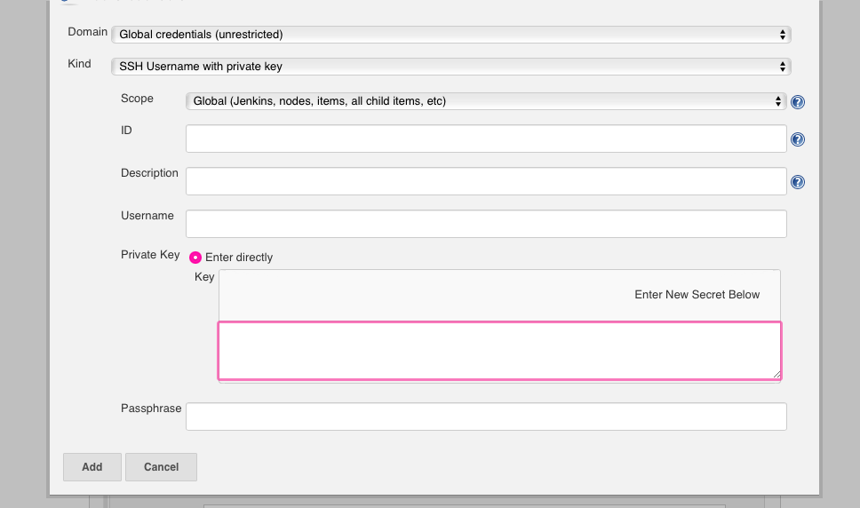
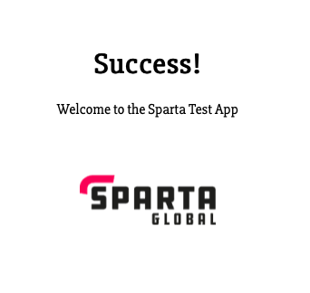

# Deploy the app to Jenkins

## Introduction
Implement the CD aspect of CI/CD by deploying the app to Jenkins.

## Pre-Requisites
* Git
* AWS
* Working app

## Instructions
1. Create a new repository in GitHub
2. In Jenkins, create a new job.
3. Follow the generic [configuration](https://github.com/A-Ahmed100216/Sparta_node_app) until the 'Build Environment' stage.    

**Build Environment**  
4. Select the 'Use secret text(s) or file(s)' option. Set the 'Key File Variable' as a variable name such as 'AWS ACCESS'.    
   
5. Add credentials, either select a pre-existing option or create new one by clicking 'Add'. If creating a new, select 'SSH Username with Private Key' for 'Kind'. Give a username and paste the key from the secure location it has been stored.
      


**Build**   
6. Select 'Execute Shell'  and add the following commands. This will automate authentication to obtain access to the instance.
```bash
rsync -avz -e "ssh -o StrictHostKeyChecking=no -i $AWS_ACCESS" -a . ubuntu@ip:~/
ssh -o "StrictHostKeyChecking=no" -i $AWS_ACCESS ubuntu@ip << EOF
pm2 restart app --update-env
EOF
```     
**Post- Build Actions**  
7. Select 'Git Publisher' and [configure](https://github.com/A-Ahmed100216/Sparta_node_app).    
8. Save.   
9. Navigate to AWS Management Console and amend the instance security group to give SSH permission to Jenkins i.e open port 22 to the Jenkins IP.     
10. Push to Dev branch to trigger a build.     
11. In order to test, a change was made to the app and the resulting webpage is shown below.    



# Testing Pipeline
Test 1
